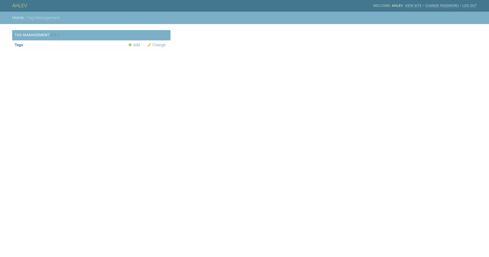

# DJANGO TAG APPLICATION
The instructions below assume that you have a django project already set up; and a python virtual environment already installed and activated. 

## styles
All ahlev-django applications are using styles from [mdbootstrap.com](https://mdbootstrap.com), so please make sure you install 
ahlev-django-css-js first before proceeding to the next step.
Here is its repository.
[ahlev-django-css-js](https://github.com/ohahlev/ahlev-django-css-js.git)

## install from this repository
### clone
```
git clone https://github.com/ohahlev/ahlev-django-tag.git
```

### go to directory ahlev-django-tag
```
cd ahlev-django-tag
```

### create installer package
```
python3 setup.py sdist
```

### go to project directory
```
pip install dist/ahlev-django-tag-0.0.1.tar.gz
```

## install from pypi
### go to the project directory and install from pypi
```
pip install -i https://test.pypi.org/simple/ ahlev-django-tag
```

## project configuration
### update settings.py as the following
```
INSTALLED_APPS = [
    'tag', # add this line
    ...
]
```

### add these lines to the end of settings.py
```
STATICFILES_DIRS = [
    os.path.join(BASE_DIR, "static")
]
#STATIC_ROOT = os.path.join(BASE_DIR, "static")
STATIC_URL = '/static/'
MEDIA_ROOT = os.path.join(BASE_DIR, 'uploads')
MEDIA_URL = '/medias/'
```

## screenshots
### frontend: about us page


### backend: home page


### backend: list about us


### backend: edit about us

